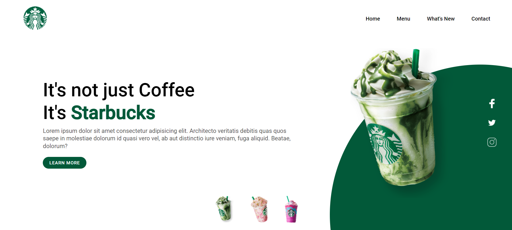

# Responsive Starbucks Landing Page

Welcome to the repository for the Responsive Starbucks Landing Page project! Developed using HTML, CSS, and JavaScript, this project creates an interactive and visually appealing webpage that reflects the cozy atmosphere of Starbucks.

## Overview 
This landing page is designed to be responsive, ensuring a seamless experience across various devices, from desktops to smartphones. A standout feature of this page is the theme selection functionality. Using JavaScript, users can customize the page according to their preferences.

## Features

- Responsiveness: The page is built with a focus on responsiveness, providing a smooth experience on any device.
- Theme Selection: Users can choose from different themes, altering the color of a page element and the cover image according to the selected button.
- Interactive JavaScript: The theme selection functionality is driven by JavaScript, offering an interactive and dynamic experience.
- Starbucks Inspiration: The design of the site is inspired by Starbucks' recognizable aesthetic, featuring coffee icons, warm colors, and brand-related visual elements.

## Author
This repository is maintained by Your [Isabela Cartaxo](https://github.com/belacartaxo).
